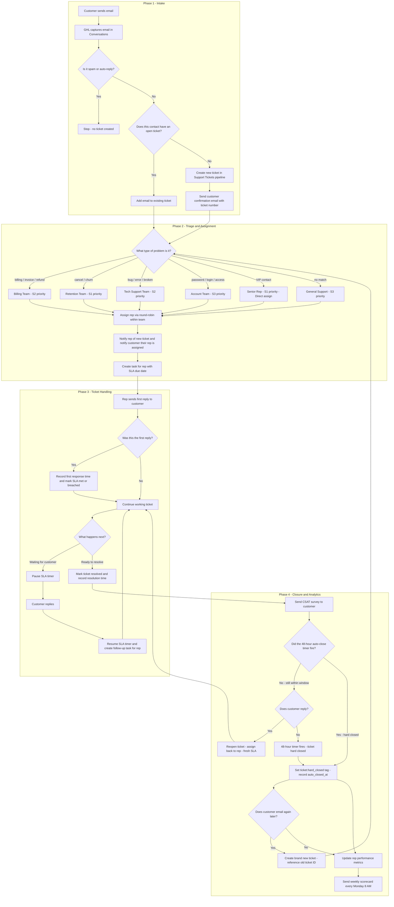

# Email-to-Task Ticketing System (GHL)

## Implementation Tiers

> 🟢 **GHL Native** — built directly in GHL workflows, no external tools needed.
> 🟡 **GHL Workaround** — achievable in GHL with a creative approach; some limitations apply.
> 🔴 **External Tool** — requires Make, Zapier, Google Sheets, or a BI tool for full accuracy.

---

## System Goal

Build an operational support system where:

1. Someone emails support.
2. GHL captures the inbound email and filters out noise (spam, auto-replies). 🟢
3. The email is matched to an existing open ticket or a new ticket is created. 🟡
4. The task is assigned to an owner with a fallback rule. 🟢
5. SLA timers run during business hours, pause when waiting on the customer, and resume on reply. 🟡
6. Performance analytics and CSAT are tracked per individual. 🟡 / 🔴

---

## End-to-End Flow Diagram

---

## How We Do This in GHL

### 1) Capture inbound email 🟢

- Connect support mailbox to GHL Conversations.
- Use workflow trigger: `Customer Replied` (channel = Email, inbox = Support).

### 2) Spam and auto-reply filter 🟢

Add a filter condition at the top of Workflow A **before** any ticket action:

| Signal              | Filter rule                                                                                 |
| ------------------- | ------------------------------------------------------------------------------------------- |
| Auto-reply subject  | Subject contains: `out of office`, `automatic reply`, `auto-reply`, `vacation`, `away from` |
| No-reply sender     | From address contains: `noreply`, `no-reply`, `donotreply`, `mailer-daemon`                 |
| Bounce notification | Subject contains: `delivery failed`, `undeliverable`, `mail delivery`                       |
| Unsubscribe         | Subject contains: `unsubscribe`                                                             |

If **any** filter matches → stop workflow. Do not create a ticket.

> **GHL implementation**: Use workflow `If/Else` conditions on `Contact Email` and `Message Subject` fields at the top of Workflow A.

### 3) Thread matching / deduplication logic 🟡

Before creating a new ticket, check for an existing open ticket for this contact:

- **Primary match** 🟢: Contact has an open opportunity in the `Support Tickets` pipeline with stage NOT in `Resolved` or `Closed`. Use workflow condition: "If opportunity exists in pipeline → branch to existing ticket path."
- **Secondary match** 🟡: Store the base email subject (strip `Re:`, `Fwd:`) in `ticket_subject` at creation. On inbound, compare incoming subject to `ticket_subject` via workflow condition.
- **Conflict rule** 🟡: If a contact has multiple open tickets, match on the most recently updated one. Log a note: `Thread matched by subject: {{email.subject}}`.
- **True thread matching by email header** 🔴: GHL does not expose `In-Reply-To` / `Message-ID` headers. Accurate header-based deduplication requires an external email parser (Make/Zapier middleware).
- If no match → create a new ticket.

### 4) Create or update a ticket 🟢

- Use an Opportunity as the ticket record in pipeline: `Support Tickets`.
- Stages: `New` → `Assigned` → `In Progress` → `Waiting on Customer` → `Resolved` → `Closed`.

#### Ticket custom fields

| Field                               | Type      | Purpose                                              | Tier                                    |
| ----------------------------------- | --------- | ---------------------------------------------------- | --------------------------------------- |
| `ticket_id`                         | Text      | Auto-generated unique ID                             | 🟢                                      |
| `ticket_subject`                    | Text      | Base subject (Re:/Fwd: stripped) for thread matching | 🟢                                      |
| `ticket_source`                     | Dropdown  | `email`, `chat`, `phone`, `form`                     | 🟢                                      |
| `ticket_owner`                      | Text      | Assigned rep name/ID                                 | 🟢                                      |
| `ticket_opened_at`                  | Date/Time | Set on ticket creation                               | 🟢                                      |
| `ticket_first_response_at`          | Date/Time | Set once on first outbound human reply               | 🟢                                      |
| `ticket_resolved_at`                | Date/Time | Set on resolution                                    | 🟢                                      |
| `ticket_sla_first_response_due_at`  | Date/Time | `ticket_opened_at` + SLA target                      | 🟢                                      |
| `ticket_sla_resolution_due_at`      | Date/Time | `ticket_opened_at` + resolution target               | 🟢                                      |
| `ticket_sla_paused_at`              | Date/Time | Set when stage → Waiting on Customer                 | 🟢                                      |
| `ticket_sla_pause_duration_minutes` | Number    | Cumulative pause time (subtracted from elapsed)      | 🟡 Calculated externally, stored in GHL |
| `ticket_reopen_count`               | Number    | Incremented each time ticket is reopened             | 🟢                                      |
| `ticket_csat_score`                 | Number    | 1–5 or thumbs up/down from CSAT survey               | 🟢                                      |
| `ticket_auto_closed_at`             | Date/Time | Set when auto-close timer fires (hard close)         | 🟢                                      |

### 5) Convert email into task 🟢

Workflow action sequence:

1. 🟢 Find/create contact from email sender.
2. 🟢 Run spam/auto-reply filter (stop if matched).
3. 🟡 Search for existing open ticket (dedup check — contact-level match in GHL; header-level match requires external tool).
4. 🟢 Create opportunity if no open ticket; set `ticket_opened_at`, `ticket_subject`, `ticket_source = email`.
5. 🟢 Set `ticket_sla_first_response_due_at` = now + SLA target (e.g., 15 minutes).
6. 🟢 Set `ticket_sla_resolution_due_at` = now + resolution target (e.g., 24 hours).
7. 🟢 Apply SLA classification tags (severity + first-response + resolution targets).
8. 🟢 Create task: `Reply to {{contact.first_name}} - {{ticket_id}}`.
9. 🟢 Set task due date = `ticket_sla_first_response_due_at`.

### 6) Triage — categorize by problem type and set priority 🟢

Before assigning, the workflow detects the ticket category from the email subject and body using `If/Else` keyword conditions. This determines which **queue** the ticket enters and which **severity** SLA applies.

#### Queue detection (keyword matching on subject + body)

| Keywords detected                                         | Queue tag applied     | Assigned team  | Default severity |
| --------------------------------------------------------- | --------------------- | -------------- | ---------------- |
| `billing`, `invoice`, `charge`, `refund`, `payment`       | `queue:billing`       | Billing team   | S2               |
| `cancel`, `cancellation`, `downgrade`, `churn`            | `queue:cancellations` | Retention team | S1               |
| `bug`, `error`, `broken`, `not working`, `crash`, `issue` | `queue:technical`     | Tech support   | S2               |
| `password`, `login`, `access`, `locked out`, `2fa`        | `queue:account`       | Account team   | S3               |
| `onboarding`, `setup`, `getting started`, `how do I`      | `queue:onboarding`    | Success team   | S3               |
| `feature`, `request`, `suggestion`, `feedback`            | `queue:feedback`      | Product team   | S4               |
| No keyword match                                          | `queue:general`       | General pool   | S3               |

> **GHL implementation** 🟢: Use nested `If/Else` branches in Workflow A. Check `Message Subject` and `Message Body` contains each keyword group. Apply the matching queue tag and severity tag, then continue to assignment.

#### VIP detection (contact-level override) 🟢

Before keyword matching, check if the contact already has a `vip` tag:

- If yes → override queue to `queue:vip`, set severity to `S1`, assign to senior rep directly (skip round-robin).
- VIP contacts can be tagged manually or automatically (e.g., contacts with high deal value in GHL CRM).

#### Priority within a queue 🟡

GHL does not have a native priority-ordered queue view. Approximation:

- 🟡 Severity tag (`sla:sev:s1` through `s4`) sets the SLA due time — S1 tickets breach soonest and appear as overdue tasks first in the rep's task list.
- 🟡 Each team works from their own pipeline view filtered by their queue tag — so reps only see their category.
- 🔴 True priority queue ordering (sorted by SLA due date, severity, and wait time) requires an external dashboard (Google Sheets sorted view, or a BI tool connected via webhook).

#### Severity → SLA mapping

| Severity      | First response target | Resolution target | Example use case                   |
| ------------- | --------------------- | ----------------- | ---------------------------------- |
| S1 — Critical | 15 minutes            | 4 hours           | Cancellation, payment failure, VIP |
| S2 — High     | 30 minutes            | 8 hours           | Billing dispute, technical bug     |
| S3 — Normal   | 60 minutes            | 24 hours          | Account access, general support    |
| S4 — Low      | 4 hours               | 72 hours          | Feature request, feedback          |

### 7) Assign to the right rep 🟢

#### How to set up round-robin in GHL

**Step 1 — Create a Team for each queue** 🟢

Go to **Settings → Teams → Add Team**. Create one team per queue:

| Team name                 | Members                  |
| ------------------------- | ------------------------ |
| `Support - Billing`       | All billing reps         |
| `Support - Cancellations` | All retention reps       |
| `Support - Technical`     | All tech support reps    |
| `Support - Account`       | All account reps         |
| `Support - Onboarding`    | All success reps         |
| `Support - General`       | All general support reps |
| `Support - VIP`           | Senior rep(s) only       |

**Step 2 — Add the "Assign User" action in Workflow A** 🟢

After the triage `If/Else` branch sets the queue tag, add an `Assign User` workflow action for each branch:

1. In the workflow action, select **"Assign to Team"**.
2. Choose the matching team (e.g., `Support - Billing` for the billing branch).
3. Set distribution to **"Round Robin"** — GHL cycles through team members in order, one ticket at a time.
4. Enable **"Allow Re-assignment"** if you want the system to skip reps who are offline (optional).

> **Alternative distribution mode**: Instead of Round Robin, GHL also offers **"Least Busy"** — assigns to the team member with the fewest open conversations. Use this if workload balance matters more than strict rotation.

**Step 3 — VIP direct assignment** 🟢

For `queue:vip`, skip the team round-robin. Use `Assign User` → **"Assign to Specific User"** → select the designated senior rep by name.

**Step 4 — Fallback if no rep is assigned** 🟡

Add a `Wait` step (2 minutes) after the assign action. Then add an `If/Else`:

- Condition: `Assigned User` is empty.
- If true → `Assign User` → specific manager + add tag `sla:state:unassigned_fallback` + send internal alert.

#### Full assignment routing summary

After triage sets the queue tag, the `Assign User` action routes by queue:

- 🟢 `queue:billing` → Round-robin within `Support - Billing` team.
- 🟢 `queue:cancellations` → Round-robin within `Support - Cancellations` team.
- 🟢 `queue:technical` → Round-robin within `Support - Technical` team.
- 🟢 `queue:account` → Round-robin within `Support - Account` team.
- 🟢 `queue:onboarding` → Round-robin within `Support - Onboarding` team.
- 🟢 `queue:vip` → Direct assign to designated senior rep (no round-robin).
- 🟢 `queue:general` → Round-robin within `Support - General` team.
- 🟡 No assignment after 2 min → Fallback to manager + alert.

- 🟢 Notify assignee via internal email/SMS/Slack webhook (ticket link + customer name + SLA due time).
- 🟢 Move opportunity stage to `Assigned`.

### 8) Business hours 🟡

> **GHL does not natively support business-hours SLA math.**
>
> Workarounds:
>
> - 🟡 Schedule Workflow C to run **only during business hours** (Mon–Fri 8 AM–6 PM) using GHL's time-of-day filter. This prevents false breach alerts outside hours but does not adjust elapsed time math.
> - 🟡 Tag tickets created outside business hours with `sla:intake:after_hours` and manually set SLA due fields to the next business day open time in the workflow.
> - 🔴 For accurate business-hours elapsed time calculation (excluding nights/weekends), use an external tool: Google Sheets formula, Make/Zapier step, or a BI tool.

### 9) Measure handling quality by individual

| KPI                       | Source                                          | Tier                                        |
| ------------------------- | ----------------------------------------------- | ------------------------------------------- |
| `Tickets Assigned`        | Count of opportunities assigned to owner        | 🟢 GHL Dashboard                            |
| `Tickets Resolved`        | Count of opportunities moved to Resolved/Closed | 🟢 GHL Dashboard                            |
| `Open Backlog`            | Count of open tickets currently assigned        | 🟢 GHL Dashboard                            |
| `Overdue Tasks`           | Tasks past due date                             | 🟢 GHL Dashboard                            |
| `Avg First Response Time` | Avg of `first_response_minutes`                 | 🟡 Stored in GHL; avg computed in Sheets/BI |
| `Avg Resolution Time`     | Avg of `resolution_minutes`                     | 🟡 Stored in GHL; avg computed in Sheets/BI |
| `SLA Breach Count (FR)`   | Count of `sla:state:breached_fr` tags           | 🟢 GHL tag filter                           |
| `SLA Breach Count (Res)`  | Count of `sla:state:breached_res` tags          | 🟢 GHL tag filter                           |
| `Reopen Rate`             | `ticket_reopen_count > 0` / total resolved      | 🔴 Ratio requires external calculation      |
| `Avg CSAT Score`          | Avg of `ticket_csat_score` per owner            | 🟡 Stored in GHL; avg computed in Sheets/BI |
| `Owner trend over time`   | Historical SLA adherence and throughput per rep | 🔴 Requires external BI / Sheets            |

---

## SLA Tagging Standard (Helpdesk Reporting) 🟢

Use this tag format so reporting is consistent by owner, severity, and SLA outcome.

### Classification tags (set at triage)

- Severity (one only): `sla:sev:s1` | `sla:sev:s2` | `sla:sev:s3` | `sla:sev:s4`
- First-response target (one only): `sla:fr:15m` | `sla:fr:30m` | `sla:fr:60m` | `sla:fr:240m`
- Resolution target (one only): `sla:res:4h` | `sla:res:8h` | `sla:res:24h` | `sla:res:72h`
- Queue (one only): `queue:billing` | `queue:cancellations` | `queue:technical` | `queue:account` | `queue:onboarding` | `queue:feedback` | `queue:vip` | `queue:general`

### Runtime state tags

- `sla:state:on_track`
- `sla:state:at_risk` (80% of SLA time consumed)
- `sla:state:paused_waiting_customer`
- `sla:state:breached_fr`
- `sla:state:breached_res`
- `sla:state:unassigned_fallback`
- `sla:intake:after_hours`

### Outcome tags (keep for historical reporting)

- `sla:state:met_fr`
- `sla:state:met_res`

### Tag rules

1. Keep exactly one severity tag per ticket.
2. Keep exactly one first-response target tag and one resolution target tag.
3. Keep only one active runtime state tag at a time.
4. Keep `met_*` and `breached_*` tags after closure for KPI reporting.
5. `sla:state:paused_waiting_customer` replaces the active runtime tag while paused; restore previous state tag on resume.

---

## Required Workflows

### Workflow A: Intake, Spam Filter, and Assignment 🟢

- **Trigger**: `Customer Replied` — channel = Email, inbox = Support.
- **Step 1 — Spam filter** 🟢: Check subject and sender against filter rules. If matched → stop.
- **Step 1b — Direction guard** 🟢: Add condition `Message Direction` = `Inbound`. This ensures agent outbound emails (automated replies, follow-ups) never create tickets or trigger dedup logic.
- **Step 2 — Dedup check** 🟡: Search for existing open ticket for this contact. If found → attach message, resume SLA if paused (go to Step 5). If not found → continue. _(Contact-level match only in GHL; header-level match requires external tool.)_
- **Step 3 — Create ticket** 🟢: Create opportunity in `Support Tickets` pipeline. Set `ticket_opened_at`, `ticket_subject`, `ticket_source`. Set SLA due fields. Apply classification tags. Add `sla:state:on_track`.
- **Step 4 — Customer acknowledgement email** 🟢: Immediately send an automated reply to the customer confirming receipt. Template:
  > _Subject: We received your request — Ticket #{{ticket_id}}_
  > _Hi {{contact.first_name}}, we've received your email and created a support ticket (#{{ticket_id}}). Our team will respond within [SLA target]. You'll hear from us shortly._
- **Step 5 — Create task** 🟢: `Reply to {{contact.first_name}} - {{ticket_id}}`. Due = `ticket_sla_first_response_due_at`.
- **Step 6 — Assign owner** 🟡: Round-robin or rules-based. Add 2-minute `Wait`; if `ticket_owner` still empty → fallback to manager + tag `sla:state:unassigned_fallback` + alert.
- **Step 7 — Notify rep** 🟢: Send internal notification to the assigned rep via email/SMS/Slack webhook. Include: ticket link, customer name, subject, and SLA due time.
- **Step 8 — Customer notified rep accepted** 🟢: Once `ticket_owner` is set, send a second email to the customer confirming who will handle their ticket. Template:
  > _Subject: Your ticket #{{ticket_id}} has been assigned_
  > _Hi {{contact.first_name}}, {{ticket_owner}} is now handling your request and will be in touch shortly._

### Workflow B: First Response Tracking 🟢

- **Trigger**: `Conversation Message Added` — direction = Outbound, type = Human (not automated).
- **Condition**: `ticket_first_response_at` is empty.
- **Actions**:
  - 🟢 Set `ticket_first_response_at` = now.
  - 🟡 Calculate `first_response_minutes` = (`ticket_first_response_at` − `ticket_opened_at`) in minutes. _(GHL cannot subtract timestamps natively. Workaround: use a webhook to Make/Zapier to compute and write back, OR accept raw timestamps and compute in reporting.)_
  - 🟢 If `ticket_first_response_at` ≤ `ticket_sla_first_response_due_at` → add `sla:state:met_fr`. Else → add `sla:state:breached_fr`.
  - 🟢 Move stage to `In Progress`.

> **Guard against automated replies** 🟢: Add a workflow filter — only proceed if the message sender is a specific human user (not the system/workflow bot). Use the `Sent By` condition in GHL.

### Workflow C: SLA Escalation Check 🟡

- **Trigger**: Scheduled — every **5 minutes**, Mon–Fri 8 AM–6 PM (local business timezone). 🟡 _(Time-of-day filter approximates business hours; does not account for public holidays.)_
- **Filter**: Open tickets where `sla:state:paused_waiting_customer` is NOT present AND `sla:state:breached_fr` is NOT present (avoid re-firing).
- **Actions**:
  - 🟡 If elapsed time ≥ 80% of `ticket_sla_first_response_due_at` AND `ticket_first_response_at` is empty → remove `sla:state:on_track`, add `sla:state:at_risk`. Notify rep. _(Elapsed % check requires comparing `now` to the due field — use GHL date condition "is before" on the due field.)_
  - 🟢 If now > `ticket_sla_first_response_due_at` AND `ticket_first_response_at` is empty → add `sla:state:breached_fr`. Alert manager. Optional: reassign.
  - 🟢 If now > `ticket_sla_resolution_due_at` AND `ticket_resolved_at` is empty → add `sla:state:breached_res`. Alert manager.

### Workflow D: Resolution and Closure 🟢

- **Trigger**: Task completed OR opportunity stage manually moved to `Resolved`.
- **Actions**:
  - 🟢 Set `ticket_resolved_at` = now.
  - 🟡 Calculate `resolution_minutes` = (`ticket_resolved_at` − `ticket_opened_at` − `ticket_sla_pause_duration_minutes`). _(Timestamp subtraction requires external calculation; store raw timestamps in GHL and compute in Sheets/BI.)_
  - 🟢 If `ticket_resolved_at` ≤ `ticket_sla_resolution_due_at` → add `sla:state:met_res`. Else → add `sla:state:breached_res`.
  - 🟢 Move stage to `Resolved`.
  - 🟢 Trigger Workflow G (CSAT survey).
  - 🟢 **Auto-close timer**: Wait **48 hours** (configurable). If no inbound customer reply during that window:
    - Move stage to `Closed`.
    - Set `ticket_auto_closed_at` = now.
    - Add tag `ticket:hard_closed`.
    - This ticket **cannot be reopened**. Any future customer reply will create a new ticket via Workflow F.

> **Auto-close window**: The 48-hour default can be adjusted per queue. For example, billing tickets may warrant 72 hours; feedback tickets 24 hours. Update the `Wait` duration in Workflow D per queue branch as needed.

### Workflow E: SLA Pause and Resume 🟡

- **Trigger E1 — Pause** 🟢: Opportunity stage changes to `Waiting on Customer`.
  - Set `ticket_sla_paused_at` = now.
  - Remove current runtime state tag. Add `sla:state:paused_waiting_customer`.

- **Trigger E2 — Resume**: `Customer Replied` on a ticket in `Waiting on Customer` stage.
  - **Guard — inbound only** �: Add a condition at the top of this workflow: `Message Direction` = `Inbound`. This prevents agent outbound emails (e.g. a follow-up nudge sent while waiting) from accidentally triggering the resume and restarting the SLA clock.
  - �🟡 Calculate pause duration = (now − `ticket_sla_paused_at`) in minutes. _(Requires external calculation — webhook to Make/Zapier to compute and write `ticket_sla_pause_duration_minutes` back to GHL. Alternatively, extend due dates by a fixed buffer as an approximation.)_
  - 🟡 Add pause duration to `ticket_sla_pause_duration_minutes` (cumulative).
  - 🟡 Extend `ticket_sla_resolution_due_at` by pause duration.
  - 🟢 Clear `ticket_sla_paused_at`.
  - 🟢 Remove `sla:state:paused_waiting_customer`. Add `sla:state:on_track`.
  - 🟢 Move stage back to `In Progress`.
  - 🟢 Create new task for rep: `Follow up — {{contact.first_name}} replied`.

> **Conversation visibility** 🟢: GHL Conversations logs **all** inbound and outbound emails in the conversation thread regardless of SLA state or pipeline stage. Agents can always see the full message history — sent, received, and automated — directly in the contact's conversation view. Pausing the SLA only stops the escalation timer; it does not hide or suppress any messages. To distinguish message types at a glance, use the GHL conversation filter (Inbound / Outbound / Automated) within the thread.

### Workflow F: Ticket Reopen 🟢

- **Trigger**: `Customer Replied` — ticket stage is `Resolved` or `Closed`.
- **Guard — inbound only** 🟢: Add condition `Message Direction` = `Inbound` to prevent agent follow-up emails sent after resolution from accidentally reopening the ticket.
- **Branch — hard closed vs soft closed** 🟢:
  - **If tag `ticket:hard_closed` is present** (auto-close timer already fired):
    - Do NOT reopen the existing ticket.
    - Create a **new ticket** opportunity in the pipeline (treat as a fresh intake).
    - Set `ticket_source` = `recontact_after_close` on the new ticket.
    - Notify rep that this is a follow-up to a previously closed ticket (reference old `ticket_id`).
  - **If tag `ticket:hard_closed` is NOT present** (manually resolved but within the reopen window):
    - 🟢 Increment `ticket_reopen_count` by 1.
    - 🟢 Move stage to `In Progress`.
    - 🟢 Set `ticket_sla_first_response_due_at` = now + SLA target (fresh SLA for reopen).
    - 🟢 Add `sla:state:on_track`.
    - 🟢 Create task: `Reopened — Reply to {{contact.first_name}} - {{ticket_id}}`. Due = new SLA due.
    - 🟢 Assign to original `ticket_owner` (or round-robin if owner unavailable).
    - 🟢 Notify rep: ticket has been reopened.

### Workflow G: CSAT Collection 🟢

- **Trigger**: Called from Workflow D after resolution.
- **Actions**:
  - 🟢 Send email to customer with 1-click rating link (GHL form or survey link).
  - 🟢 Wait for form submission response.
  - 🟢 On response: set `ticket_csat_score` on the opportunity via form → custom field mapping.
  - 🟢 Tag ticket: `csat:received`.
  - 🟢 If score ≤ 2 → tag `csat:negative`, alert manager for follow-up.

---

## Analytics Delivery

### Native GHL — Fast Start 🟢

- Dashboard widgets for Tasks, Conversations response time, and Opportunities by owner/stage.
- Weekly scorecard workflow every Monday at 8:00 AM — sends per-owner summary including CSAT and reopen rate.

### Advanced — Recommended at Scale 🔴

- Subscribe to events: `InboundMessage`, `OutboundMessage`, `TaskCreate`, `TaskCompleted`, `OpportunityStageUpdate`.
- Store event stream externally (Google Sheets / database / BI tool).
- Build owner-level trend reporting for SLA adherence, throughput, CSAT trends, and reopen rate over time.
- Compute accurate business-hours elapsed time and reopen rate ratios.

---

## Build Checklist

### Infrastructure

- [ ] 🟢 Support inbox connected to GHL Conversations.
- [ ] 🟢 `Support Tickets` pipeline created with all 6 stages.
- [ ] 🟢 All 13 ticket custom fields created.
- [ ] 🟢 SLA classification tags, state tags, and queue tags created.
- [ ] 🟢 Triage keyword lists defined and `If/Else` branches built in Workflow A.
- [ ] 🟢 VIP tag configured on relevant contacts.
- [ ] 🟢 Team round-robin groups created per queue (billing, cancellations, technical, account, onboarding, general).
- [ ] 🟢 Senior rep designated for `queue:vip` direct assignment.

### Workflows

- [ ] 🟢 Workflow A: Intake, Spam Filter, and Assignment — published.
- [ ] 🟢 Workflow B: First Response Tracking — published.
- [ ] 🟡 Workflow C: SLA Escalation Check (business hours schedule set) — published.
- [ ] 🟢 Workflow D: Resolution and Closure — published.
- [ ] 🟢 Workflow E1: SLA Pause (stage → Waiting on Customer) — published.
- [ ] 🟡 Workflow E2: SLA Resume (pause duration calculated and written back) — published.
- [ ] 🟢 Workflow F: Ticket Reopen — published.
- [ ] 🟢 Workflow G: CSAT Collection — published.

### External Integrations (if using advanced tier)

- [ ] 🔴 Make/Zapier scenario for timestamp subtraction (pause duration, elapsed time).
- [ ] 🔴 Google Sheets or BI tool connected via GHL webhooks for trend reporting.
- [ ] 🔴 Business-hours elapsed time formula configured in reporting layer.

### Reporting

- [ ] 🟢 Dashboard widgets configured by owner (tasks, response time, pipeline stage).
- [ ] 🟢 Weekly scorecard workflow enabled (Monday 8:00 AM).
- [ ] 🟢 CSAT score widget added to dashboard.

### Validation

- [ ] Spam filter tested: auto-reply email does NOT create ticket.
- [ ] Thread match tested: reply to existing ticket attaches to correct opportunity.
- [ ] Multiple open tickets per contact: conflict rule routes to most recent.
- [ ] Triage tested: billing keyword email → `queue:billing` tag + S2 severity + billing rep assigned.
- [ ] Triage tested: cancellation keyword → `queue:cancellations` + S1 + retention rep assigned.
- [ ] Triage tested: no keyword match → `queue:general` + S3 + general pool.
- [ ] VIP override tested: VIP-tagged contact → `queue:vip` + S1 + senior rep, skips round-robin.
- [ ] SLA pause tested: stage → Waiting on Customer stops escalation check.
- [ ] SLA resume tested: customer reply extends due dates correctly.
- [ ] Reopen tested: customer reply after closure increments reopen count.
- [ ] CSAT tested: survey sent, score stored on opportunity.
- [ ] Fallback assignment tested: no available rep → manager assigned + alerted.
- [ ] After-hours ticket tested: `sla:intake:after_hours` tag applied, SLA due adjusted.
- [ ] 20 end-to-end test tickets validated before rollout.

---

## Implementation Tier Summary

| Feature                         | Tier          | Notes                                       |
| ------------------------------- | ------------- | ------------------------------------------- |
| Email capture                   | 🟢 Native     | GHL Conversations + workflow trigger        |
| Spam / auto-reply filter        | 🟢 Native     | Workflow If/Else on subject + sender        |
| Contact-level deduplication     | 🟢 Native     | Workflow condition on open opportunity      |
| Subject-level deduplication     | 🟡 Workaround | Store `ticket_subject`, compare on inbound  |
| Header-level deduplication      | 🔴 External   | Requires email parser middleware            |
| Opportunity as ticket           | 🟢 Native     | GHL Pipelines + custom fields               |
| Task creation + SLA due date    | 🟢 Native     | Workflow Create Task action                 |
| Round-robin assignment          | 🟢 Native     | GHL built-in round-robin                    |
| Fallback assignment             | 🟡 Workaround | Wait step + empty-field check               |
| SLA tags (all)                  | 🟢 Native     | Workflow Add/Remove Tag                     |
| First response timestamp        | 🟢 Native     | Workflow Update Custom Field                |
| Timestamp subtraction (minutes) | 🟡 Workaround | Webhook to Make/Zapier; store result in GHL |
| SLA pause (set timestamp)       | 🟢 Native     | Workflow Update Custom Field                |
| SLA pause duration math         | 🟡 Workaround | External calc; result stored in GHL         |
| Business hours SLA              | 🟡 Workaround | Time-of-day filter on Workflow C            |
| Accurate biz-hours elapsed time | 🔴 External   | Sheets formula or BI tool                   |
| Ticket reopen                   | 🟢 Native     | Workflow trigger on stage + increment field |
| CSAT collection + storage       | 🟢 Native     | GHL form + custom field mapping             |
| Dashboard KPIs (current state)  | 🟢 Native     | GHL reporting widgets                       |
| Avg response/resolution time    | 🟡 Workaround | Timestamps stored in GHL; avg in Sheets     |
| Reopen rate %                   | 🔴 External   | Ratio requires external calculation         |
| Owner trend reporting           | 🔴 External   | Historical data requires Sheets/BI          |

---

## Version

- System doc: `1.0`
- Last updated: `2026-02-18`
